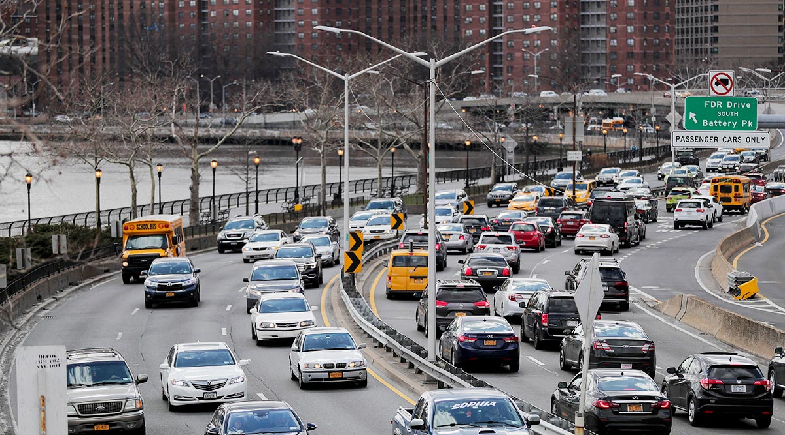
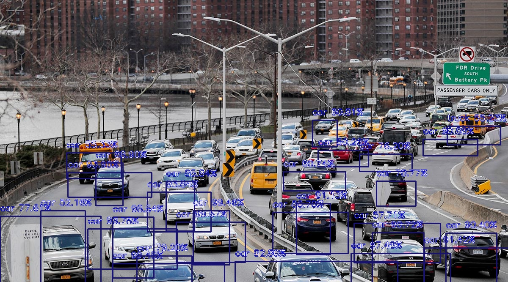

# Object Detection with [ImageAI](https://github.com/OlafenwaMoses/ImageAI)

### **Install required packages**

    $ python -m pip install -r requirements.txt

### **Detect objects**

    $ python detection.py

---

Input image:

Output image:

